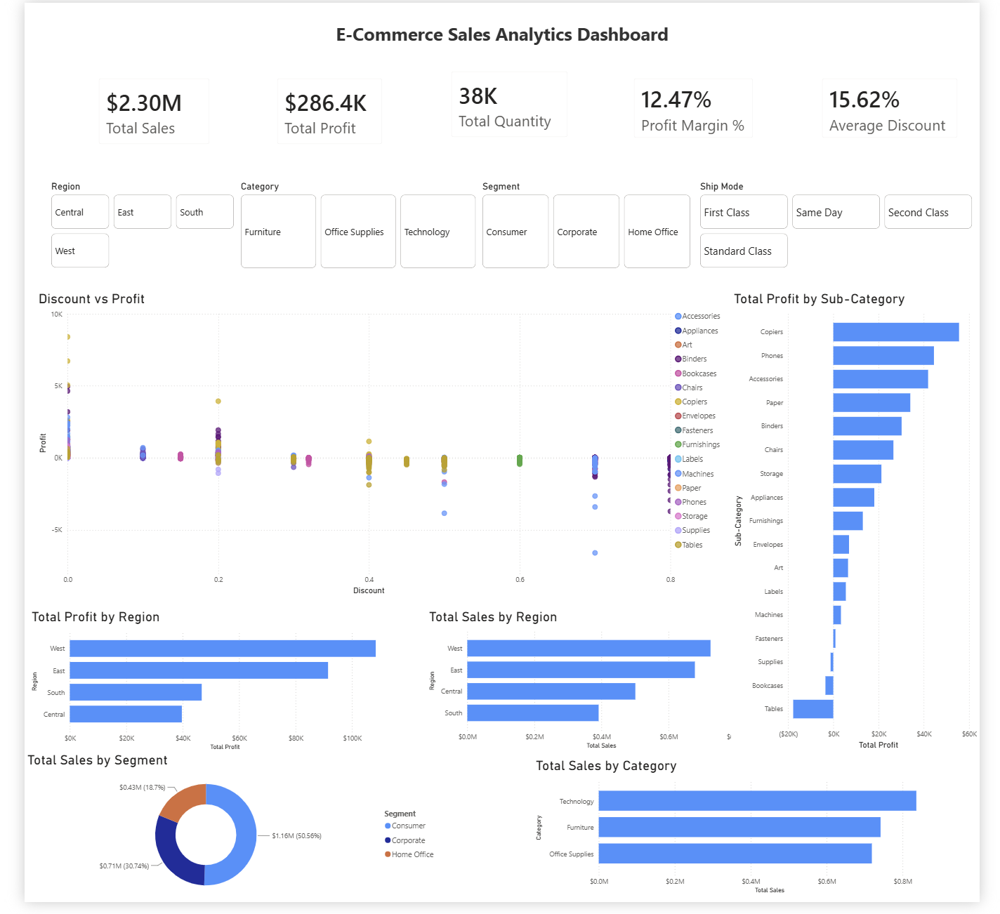

# E-Commerce Sales Analytics Dashboard

An interactive Power BI dashboard designed to analyze e-commerce sales, profitability, discounts, regions, product categories, and customer segments.



---

## 📊 Project Overview

This project analyzes e-commerce transaction data to understand overall sales and profitability performance.

The dashboard enables management to evaluate:

- Sales and profit performance
- Profitability across product sub-categories
- Regional sales and profit
- Customer segment contribution
- Category performance
- The relationship between discounts and profit

The goal is to support data-driven business decisions by bringing key performance indicators and business insights into one interactive dashboard.

---

## 🎯 Business Problem

Management needs a centralized view of e-commerce performance to identify where revenue is generated, where profit is being created or lost, and whether discounting may be affecting profitability.

The analysis focuses on identifying profitable and loss-making areas while providing interactive filters for deeper exploration.

---

## 💼 Business Requirements

The dashboard was designed to answer the following questions:

1. What are the overall sales and profit?
2. What is the overall profit margin?
3. Which regions generate the highest sales and profit?
4. Which product categories generate the highest sales?
5. Which sub-categories are most and least profitable?
6. Which customer segment contributes the most sales?
7. How does discounting relate to profit?
8. How does performance change when filtering by region, category, segment, or ship mode?

### Key KPIs

- Total Sales
- Total Profit
- Total Quantity
- Profit Margin %
- Average Discount

---

## 🗂️ Dataset

The project uses a Superstore-style e-commerce dataset containing **9,994 rows and 13 columns**.

### Key fields

| Field | Description |
|---|---|
| Ship Mode | Shipping method |
| Segment | Customer segment |
| Region | Geographic region |
| Category | Product category |
| Sub-Category | Product sub-category |
| Sales | Revenue generated |
| Quantity | Units sold |
| Discount | Discount provided |
| Profit | Profit generated |

---

## 🧹 Data Cleaning

The data was reviewed and prepared in Power BI before analysis.

Key checks included:

- Missing-value inspection
- Data-type verification
- Column relevance review
- Validation of numerical fields
- Validation of categorical fields
- Removal of unnecessary fields where appropriate

The reviewed dataset contained no blank values.

---

## 📐 Data Modeling & DAX

Power BI was used for data modeling, analysis, and visualization.

Key measures created include:

- Total Sales
- Total Profit
- Total Quantity
- Profit Margin %
- Average Discount

Percentage-based metrics were implemented as measures so that they respond dynamically to dashboard filters and slicers.

```markdown
Detailed DAX formulas and explanations are available in [`documentation/DAX_Measures.md`](documentation/DAX_Measures.md).


---

## 📊 Dashboard Features

The dashboard contains:

### KPI Cards

- **$2.30M** Total Sales
- **$286.4K** Total Profit
- **38K** Total Quantity
- **12.47%** Profit Margin
- **15.62%** Average Discount

### Interactive Filters

- Region
- Category
- Segment
- Ship Mode

### Visual Analysis

- Total Sales by Region
- Total Profit by Region
- Total Sales by Category
- Total Profit by Sub-Category
- Discount vs Profit
- Total Sales by Segment

---

## 🔍 Key Insights

### 1. Technology leads sales

Technology generates the highest sales among the three major product categories.

However, high sales do not automatically indicate high profitability.

### 2. Copiers show strong profitability

Copiers are among the strongest-performing sub-categories in terms of profit.

This creates an opportunity to investigate the factors contributing to their profitability.

### 3. Tables require further investigation

Tables show negative profitability.

Rather than immediately recommending that Tables be discontinued, further analysis should investigate:

- Pricing
- Discount levels
- Product costs
- Shipping costs
- Returns
- Regional performance
- Customer segments
- Competitive positioning
- Potential cross-selling opportunities

### 4. Discounting may affect profitability

The Discount vs Profit analysis suggests that higher discounting can be associated with weaker profitability.

However, discounting is only one factor affecting profit. Pricing, costs, product mix, region, customer segment, and other operational factors should also be considered.

### 5. Consumer is the largest sales segment

The Consumer segment contributes the highest share of sales among the customer segments.

Further analysis should compare sales contribution with profitability before making strategic decisions.

---

## 💡 Business Recommendations

### 1. Investigate loss-making sub-categories

Conduct deeper analysis of Tables to identify the underlying drivers of negative profitability before making product-level decisions.

### 2. Review discount strategy

Evaluate discount levels across products, regions, and customer segments instead of applying a blanket discount reduction.

### 3. Analyze profitable products

Investigate the pricing, cost structure, demand, and customer mix associated with highly profitable sub-categories.

### 4. Compare revenue with profitability

Management should avoid optimizing solely for sales volume. High-revenue areas should also be evaluated based on their profit contribution and margins.

### 5. Perform deeper regional analysis

Compare sales, profit, margin, and discount levels across regions to identify differences in regional performance.

---

## ⚠️ Limitations

The available dataset does not provide enough information to conclusively determine the causes of profitability differences.

The analysis does not include detailed information about:

- Product production costs
- Competitor pricing
- Customer satisfaction
- Detailed return costs
- Detailed shipping costs
- Customer lifetime value
- Marketing costs

Therefore, the dashboard identifies areas for further investigation rather than claiming causal explanations.

---

## 🛠️ Tools & Technologies

- **Power BI**
- **Power Query**
- **DAX**
- **CSV / Excel-style dataset**

---

## 📁 Repository Structure

```text
ecommerce-sales-analytics-powerbi/
│
├── README.md
│
├── dashboard/
│   ├── ECommerce_Sales_Analytics.pbix
│   └── README.md
│
├── screenshots/
│   └── dashboard.png
│
├── dataset/
│   ├── superstore.csv
│   └── README.md
│
└── documentation/
    └── DAX_Measures.md
